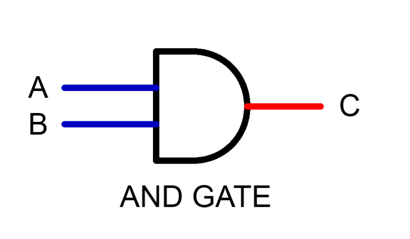

# Processing taster lessons notes

## Preface

Here are some small things that might be good to note as they are referenced multiple times across this page.

### Container types

The basic container types we've been taught are: `int`, `float`, `double`, `String`, `boolean`, `char`.

| Type      | Description                                                         | Example           |
| --------- | ------------------------------------------------------------------- | ----------------- |
| `int`     | Represents an integer, or whole number.                             | `123`             |
| `float`   | Represents a number with decimals.                                  | `1.2345678`       |
| `double`  | Represents a number with decimals with a higher degree of accuracy. | `1.2345678`       |
| `String`  | Represents a string of characters.                                  | `"Hello, World!"` |
| `boolean` | Represents a value that is either true or false.                    | `true`            |
| `char`    | Represents a singular character.                                    | `'H'`             |

> The difference between `float` and `double` is that with `float` the value is stored in memory as 32 bits,
> whereas with `double`, the value is stored in memory as 64 bits. This means that a `double` can store much more information than a `float`.
>
> We can get away with using only `double` for now.

### Comparison operators

In programming languages, it is possible to compare a value to another.

| Operator | Description                                             | Example      |
| -------- | ------------------------------------------------------- | ------------ |
| `==`     | Check if a value is equivalent to another.              | `myInt == 1` |
| `!=`     | Check if a value it not equivalent to another.          | `myInt != 1` |
| `>`      | Check if a value is greater than the other.             | `myInt > 1`  |
| `<`      | Check if a value is smaller than the other.             | `myInt < 1`  |
| `>=`     | Check if a value is greater than or equal to the other. | `myInt >= 1` |
| `<=`     | Check if a value is smaller than or equal to the other. | `myInt <= 1` |

Usage of any of these operators will always return a `boolean` value, either `true` or `false`.

## Functions

A function is just a container of code, that can be reused across your codebase.

> If you don't want the function to return anything, the container type should be `void`.

### Declaring functions

```processing
// The signature is <container type> <function name>(<parameters>) { ... }
void myFunction() {
    // Do Stuff
}

// Usually, a function that doesn't return a value is called a "procedure".
// To create a function that returns a value, we just need to declare the
// container type of what it returns correctly.

int myCoolFunction() {
    return 5;
}
```

### Calling functions

To call functions to run the code within it, use the function name and provide parameters within the parentheses.

```processing
// Since myFunction doesn't require any parameters,
// there's nothing between the parentheses.
myFunction();

// We store the returned value in a variable.
// See Variables section for more info.
int coolVariable = myCoolFunction();
```

### Processing built-in functions

Processing comes with built-in functions that are used to perform actions on the screen, etc.

One example is the [`setup()` function](https://processing.org/reference/setup_.html) that can be declared.
The `setup()` function is called at the start of a script, and allows you to setup the environment.

Another example is the [`draw()` function](https://processing.org/reference/draw_.html) that can be declared.
This function runs 60 times per second, to emulate 60 frames, and allows you to draw whatever you want on the screen.

Both of these functions do not accept any parameters, and are called automatically by Processing.

In this example:

- we will create a window of size 200x200, using the [`size()` built-in function](https://processing.org/reference/size_.html)
- set the background to [alice blue](https://rgb.to/aliceblue) using the [`background()` function](https://processing.org/reference/background_.html).
- draw a line with the [`line()` function](https://processing.org/reference/line_.html)

```processing
void setup() {
  // In this case, size() accepts two parameters:
  // width  - which accepts only an integer as its value.
  // height - which also accepts only an integer as its value.
  size(200, 200);

  // background() here is being called with 3 parameters:
  //   red   - the integer value out of 255 for the red component.
  //   green - ^
  //   blue  - ^
  background(240, 248, 255);
}

void draw() {
  // Can be thought of as two pairs of co-ordinates:
  // (10, 10) and (100, 50)
  //
  // Parameters:
  //   x1 - X value of first point.
  //   y1 - Y value of first point.
  //   x2 - X value of second point.
  //   y2 - Y value of second point.
  line(10, 10, 100, 50);
}
```

## Variables

A variable is essentially a reference to a value.
In Processing, a variable has a container type, which means the value **MUST** match that container type.

```processing
// To declare a variable, simply write
// <container type> <variable name>;
int myInt;

// To assign a value to a variable:
// <variable name> = <value that matches the container type>;
myInt = 2;
// To declare AND assign at the same time:
// <container type> <variable name> = <value that matches the container type>;
int myInt = 2;
```

We can also store the value of expressions, such as [comparison operators](#comparison-operators).

```processing
boolean isLargerThanTwo = myInt > 2;
```

## Incrementing / Decrementing

A variable that stores an integer have simple "operators", so you can easily
add or subtract from it.

```processing
int myInt = 2;
// Increment the value that the variable references by 1:
myInt++; // Becomes 3

// Decrement by 1:
myInt--; // Becomes 2
```

These are just short-hands for incrementing / decrementing the value by 1.
To change the value by more than 1, we can use "compound assignments".
That means you re-assign the value, and add the change at the same time.

```processing
int myInt = 2;
// Compound assignment, that increments "myInt" by 2
myInt += 2; // Becomes 4
// This can be thought of as:
myInt = myInt + 2;

// Compound assignment, that decrements "myInt" by 2
myInt -= 2; // Becomes 2
// This can be thought of as:
myInt = myInt - 2;
```

## Selection (If / Else Statements)

`if` / `else` statements allows us to run different branches of code based on a condition.
In an `if` statement, the condition must evaluate to be `true` for the code within its branch to run. For the condition, we can use [comparison operators](#comparison-operators) combined with [boolean logic](#boolean-logic), which comes in later on.

```processing
int red = 0;
int green = 0;
int blue = 0;

void draw() {
    // NOTE: The condition must be wrapped in parentheses.
    // If the value of "red" is more than 255,
    if (red > 255) {
        // Re-assign "red" to 0
        red = 0;
    }

    // Set the background to the values of the corresponding variables.
    background(red, green, blue);

    // Increment "red" by 1.
    red++;
}
```

In the previous example, there was no `else` block, which meant the code after the `if` block is run afterwards, regardless of whether or not the condition passed. Using the `else` block, we can run other code if the condition doesn't pass.

```processing
int myInt = 5;
if (myInt == 5) {
   // If myInt is 5
   // Do Stuff
}
// Else statements are used if the if statement's condition
// doesn't succeed
else {
   // Do other stuff if myInt isn't 5
}
```

## Input / Output

### Input

The way we learnt to get text input was with:

```processing
import static javax.swing.JOptionPane.*;
String input = showInputDialog("Enter something: ");
```

This utilises a Java "standard library" function to open a window with a text input box where the user can type in.

> Processing allows you to access any functions or other components that are part of Java within Processing.
> The official documentation for `showInputDialog()` is [here](<https://docs.oracle.com/javase/7/docs/api/javax/swing/JOptionPane.html#showInputDialog(java.lang.Object)>), but for all intents and purposes, we can think of the function signature of `showInputDialog()` as:
>
> ```processing
> String showInputDialog(String prompt) {
>   // Spooky code we don't really need to know about...
> }
> ```

We can also try to read the value, or parse, as container types other than String by attempting to understand them as such.

Example of understanding input as `int`:

```processing
int inputAsInt = parseInt(input, MIN_INT);

// The second parameter here "MIN_INT" is used as a "fallback",
// in case the input can't be read as an integer.
// MIN_INT is just the smallest possible integer that Processing
// or the Operating System can handle.
```

Processing also has a special [`keyPressed()` function](https://processing.org/reference/keyPressed_.html), which detects when a key is pressed.

```processing
void keyPressed() {
  // "key" is a special variable that only exists within the
  // "keyPressed" function -- Processing provides it to us!
  if (key == 'q') {
    // Do Stuff!
  }
}
```

### Output

We can print to the console whatever we want, using functions such as the [`print()` function](https://processing.org/reference/print_.html), or [`println()` function](https://processing.org/reference/println_.html).

```processing
// To print things to the console, we can use:
print("Stuff!");
```

However, this will not add a newline to the end, so calling `print("Stuff!");` again will result in the console saying:

```
Stuff!Stuff!
```

So we can use `println("Stuff!");` instead:

```processing
println("Stuff!");
println("More Stuff!");
```

Output:

```
Stuff!
More Stuff!
```

## For loops

```processing
// For loops consist of 4 components:
for (int i = 0; i < 5; i++) {
  print(i);
}
// 1. A variable is declared and assigned to 0,
// 2. A condition is created, describing that the variable should be less than 5.
// 3. The behaviour after each loop is declared, in this case, after
//    running the code within the curly brackets once, the variable
//    is incremented by 1.
//
// This for loop essentially means:
//   While "i" is less than 5, keep running the code each loop, and increment "i"
//   by 1 each loop.
//   Since "i" is assigned as 0, it means that the code will be ran 5 times.
//   And "i" will be in the range of 0 - 4.
```

## Arrays

An array is a collection of a container type, with a fixed size.

### Arrays in Processing

The most simple form of it in Processing is `String`, which is essentially just a collection of singular characters, or the container type `char` in Processing.

```processing
// Let's make a string.
String myString = "hello";
// This could be thought of as:
char[] myString = new char[5];
// As you can see, 'new char[5]' initiates a new array,
// with a fixed size of 5.
// A fixed size means that you can never increase or decrease the size
// of the array.

// To access an item in an array,
// we use square brackets with the index
// of the item.
// NOTE: indexes start at 0.
//       this means that the first item is accessed with
//       an index of 0, and so on.
myString[0] = 'h';
myString[1] = 'e';
myString[2] = 'l';
myString[3] = 'l';
myString[4] = 'o';
// Or more simplified;
char[] myEasierToWriteString = { 'h', 'e', 'l', 'l', 'o' };
// This still means that the array has a fixed size of 5.

// An array of characters :sunglasses:
// We cannot add/remove items to/from the array of characters.
// This is because the size of an array is "read-only", or immutable.

// But, this does not mean that individual items within the array cannot be changed.
myEasierToWriteString[4] = 'a';
// The array has already been allocated a size of 5, so changing the
// value at index 4, or the 5th item, is not affecting the size.
```

To get the allocated size of an array, we can use the `.length` attribute of an `array` value.

```processing
char[] myEasierToWriteString = { 'h', 'e', 'l', 'l', 'o' };
// We can use iteration alongside the maximum size of the array.
// Which means writing the condition to succeed when "i"
// is less than the length of the array, which in this case,
// is 5.
// So "i" will be in the range of 0 - 4.
for (int i = 0; i < myEasierToWriteString.length; i++) {
  println("At Index", i, ":", myEasierToWriteString[i]);
}
```

Output:

```
At Index 0 : h
At Index 1 : e
At Index 2 : l
At Index 3 : l
At Index 4 : o
```

To read up more about Processing arrays, feel free to check out [their documentation](https://processing.org/reference/Array.html).

### Arrays in memory

If you try to think of arrays from a memory's perspective, each item of the array has a fixed size.
Say for example, each item in the array has a size of 8, and the array was stored in address 80 of the memory.

```py
>>> myNewArrayOfIntegers = [2, 3, 4]
+----+----+----+
| 80 | 88 | 96 |
|----+----+----|
| 2  | 3  | 4  |
+----+----+----+
```

As you can see, at address 80, we have the first value stored, 2.
At address 88, we have the second value stored, 3, and so on.
The interval between these addresses is 8, because the size of each item in the array is 8!

When we say arrays have a fixed size, it's because it's designed to prevent accidentally accessing other bits of memory.
For my array `myNewArrayOfIntegers`, the size of the array is 3, and because the size of each item is 8, it is allocated 3 \* 8 addresses in memory, or rather, addresses 80 - 104.

We have no idea what the heck could be on address 105 onwards, because those addresses aren't allocated to us, or the array rather! It could be allocated to some other program, or a critical function like the operating system, or drawing onto the screen.
If we were allowed to set whatever was at address 105, we could potentially accidentally break the whole computer!

## Boolean Logic

There are a few "Boolean operators", or logic gates. We know them as AND, OR, and NOT.
In processing, they are `&&`, `||`, and `!`.

### AND



this logic gate requires two items, and tells us if both items are true. We can think of this as the intersection of a venn diagram.

Truth table for an AND gate:

| A   | B   | C   |
| --- | --- | --- |
| 0   | 0   | 0   |
| 0   | 1   | 0   |
| 1   | 0   | 0   |
| 1   | 1   | 1   |

For an AND gate, both A and B must be 1.

### OR


this logic gate requires two items and tells us if either one of the items are true. We can think of this as covering all of the inner bits of a venn digram.

Truth table for an OR gate:

| A   | B   | C   |
| --- | --- | --- |
| 0   | 0   | 0   |
| 1   | 0   | 1   |
| 0   | 1   | 1   |
| 1   | 1   | 1   |

For an OR gate, either A or B must be 1.

### NOT


this logic gate requires one item, and basically inverts the value of that item. If the item is true, the result is false. If the item is false, the result is true.

Truth Table for a NOT gate:

| IN  | OUT |
| --- | --- |
| 0   | 1   |
| 1   | 0   |

For a NOT gate, IN is inverted.

### Usage in Processing

We can use boolean logic in if / else statements to combine conditions.

```processing
// Following from the Input/Output example,
// If inputAsInt is ever MIN_INT, it is because their input
// could not be read as an integer.
// So, this checks if it is a valid integer AND if it is
// greater than 0.
if (inputAsInt != MIN_INT && inputAsInt > 0) {
  print("Hello! I am", inputAsInt, "years old!");
} else {
  print("Please provide a valid positive integer.");
}
```

The comparison operator `!=` could also be thought of as:

```processing
if (!(inputAsInt == 5)) {
  // Do Stuff
}
```

As Processing internally inverts the result of `x == y`.
