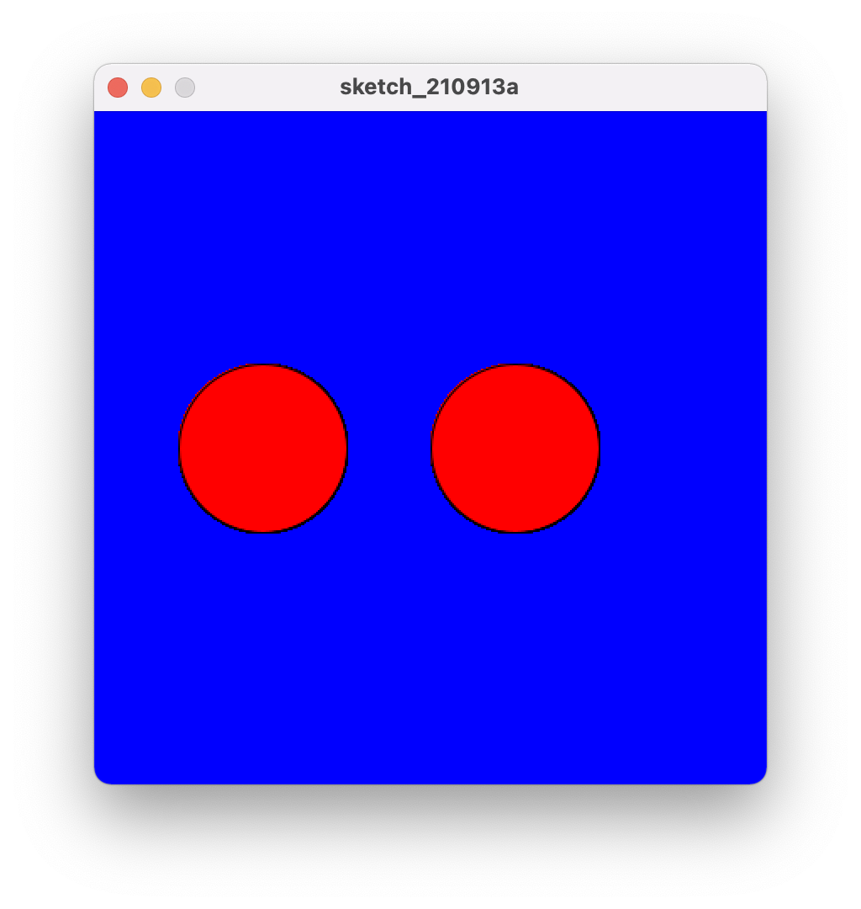
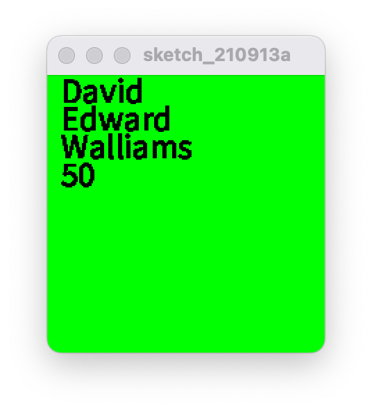
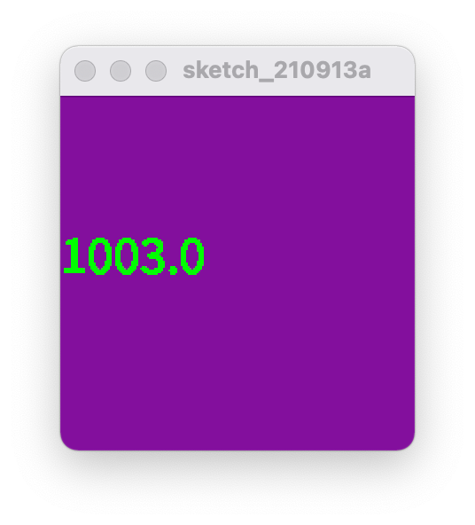
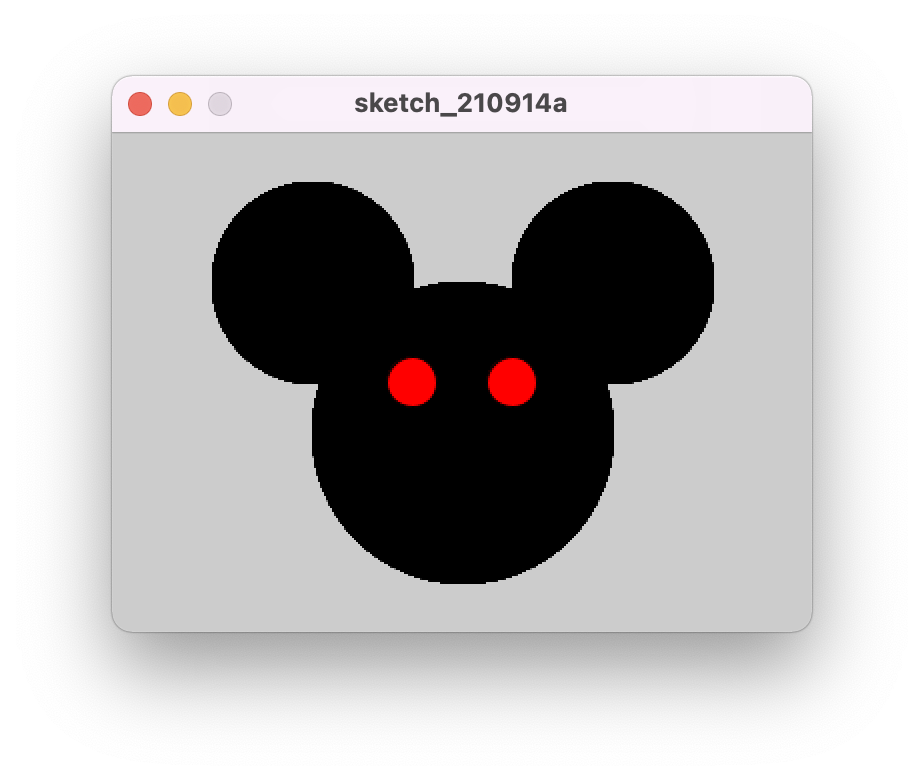

# FILL() function

The `FILL()` function sets the colour to fill shapes that are created after it.

## Part 1

In this example, `FILL()` is called before creating each ellipse, which sets the colour for each ellipse to be different.

```processing
void setup() {
    size(700, 600);
    background(23, 23, 100);
}

void draw() {
    fill(0, 240, 0);
    ellipse(67, 67, 101, 69);
    fill(0, 0, 240);
    ellipse(200, 200, 150, 67);
}
```


## Part 2

In this example, `FILL()` is called during `setup()`, which essentially does the same thing as the first example, as all following shapes are set to fill to the specified colour -- a shade of red.

```processing
void setup() {
    size(700, 600);
    background(23, 23, 100);
    fill(240, 0, 0);
}

void draw() {
    ellipse(67, 67, 101, 69);
    ellipse(200, 200, 150, 67);
}
```


# Task 1

```processing
/// sets up the environment.
void setup() {
    size(400, 200);
    background(0, 0, 0);
    stroke(200, 200, 200);
}

/// called every frame.
void draw() {
  drawLineGroup(50, 50);
  drawLineGroup(250, 50);
  drawLineGroup(150, 150);
}

/// draws 4 horizontal lines which are 100 pixels long, with a spacing of 5 pixels between each of the lines.
void drawLineGroup(float x, float y) {
  for (int i = 0; i < 4; i++) {
    int offset = 5 * i;
    drawStraightLine(x, y + offset);
  }
}

/// draws a horizontal line which is 100 pixels long.
void drawStraightLine(float x, float y) {
  line(x, y, x+100, y);
}
```


# Task 2

```processing
void setup() {
  size(400,  300);
}

void draw() {
  drawRing(50, 0, 200, 100);

  fill(0, 0, 255);
  rect(0, 120, 400, 60);
}

// Draws the red ring behind the blue bar.
void drawRing(float x, float y, int radius, int width) {
  int maxRadius = radius + width;
  float center = maxRadius / 2;

  // Creates an isolated graphic "context" to draw the circle within.
  // This allows us to manipulate the end product of this graphic.
  // Without affecting anything else on the main graphic displayed
  // on the window.
  PGraphics redCircle = createGraphics(maxRadius + 2, maxRadius + 2);
  redCircle.beginDraw();
  redCircle.fill(255, 0, 0);
  // Draw the red circle
  redCircle.ellipse(center, center, maxRadius, maxRadius);

  // This means that the alpha value of the filled shape will affect the
  // graphic.
  redCircle.blendMode(REPLACE);
  // Since the alpha value is 0, it means that anything below it will be
  // subtracted.
  redCircle.fill(255, 255, 255, 0);
  redCircle.ellipse(center, center, radius, radius);
  redCircle.endDraw();

  // Draw the graphic onto the main graphic shown on the window.
  image(redCircle, x, y);
}
```


# Task 3

```processing
int radius = 100;
color bgColor = color(0, 0, 255);
color fgColor = color(255, 0, 0);
int circlesY = 200;
int leftCircleX = 100;
int rightCircleX = 250;

void setup() {
 size(400, 400);
 background(bgColor);
}

void draw() {
 fill(fgColor);
 ellipse(leftCircleX, circlesY, radius, radius);
 ellipse(rightCircleX, circlesY, radius, radius);
}
```



# Task 4

```processing
int radius = 100;
color bgColor = color(0, 0, 255);
color fgColor = color(255, 0, 0);
int circlesY = 200;
int leftCircleX = 100;
int rightCircleX = 250;
int frame = 0;

void setup() {
 size(400, 400);
}

void draw() {
 // essentially clears canvas every frame, otherwise there would be residual ellipses from previous draw calls.
 background(bgColor);
 fill(fgColor);

 // draws two ellipses, one that drifts towards the bottom-left corner,
 // and another that drifts towards the top-right corner.
 ellipse(leftCircleX - frame * 2, circlesY + frame, radius, radius);
 ellipse(rightCircleX + frame * 5, circlesY - frame, radius, radius);

 // increments the value used for setting the X and Y values of the ellipses for the animations.
 frame++;
}
```

# Task 5

```processing
String firstName = "David", middleName = "Edward", surname = "Walliams";
int age = 50;
int textX = 10;
int textY = 20;
int textInterval = 20;
int textSize = 25;
color bgColor = color(0, 255, 0);
color textColor = color(0, 0, 0);

void setup () {
 size(200, 200);
 background(bgColor);
 fill(textColor);
 textSize(textSize);
}

void draw() {
 text(firstName, textX, textY);
 text(middleName, textX, textY + textInterval);
 text(surname, textX, textY + textInterval * 2);
 text(age, textX, textY + textInterval * 3);
}
```



# Task 6

```processing
color bgColor = color(131, 15, 157);
color textColor = color(0, 255, 0);
int textSize = 30;
int initialValue = 78, initialDenominator = 89 * 4, finalDenominator = 57 / 12, secondValue = 1003;
double calculation = (initialValue / (initialDenominator) / (finalDenominator)) + secondValue;
int textX = 0, textY = 100;

void setup() {
  size(200, 200);
  background(bgColor);
  fill(textColor);
  textSize(textSize);
}

void draw() {
  text(Double.toString(calculation), textX, textY);
}

```



# Task 7

```processing
int leftEarX = 100;
int rightEarX = 250;
int earY = 75;
int earRadius = 100;
int faceX = 175;
int faceY = 150;
int faceRadius = 150;
int leftEyeX = 150;
int rightEyeX = 200;
int eyeY = 125;
int eyeRadius = 25;
color eyeColor = color(255, 0, 0);
color skinColor = color(0);

void setup() {
  size(350, 250);
}

void draw() {
  fill(skinColor);
  ellipse(leftEarX, earY, earRadius, earRadius);
  ellipse(rightEarX, earY, earRadius, earRadius);
  ellipse(faceX, faceY, faceRadius, faceRadius);
  fill(eyeColor);
  ellipse(leftEyeX, eyeY, eyeRadius, eyeRadius);
  ellipse(rightEyeX, eyeY, eyeRadius, eyeRadius);
}
```



# Task 8

```processing
int squareLength = 10;
int squareX = 0;
int squareY = 100;
int phase = 0;
int frame = 0;
color bgColor = color(0, 0, 255);

void setup() {
  size(200, 200);
  background(bgColor);
}

void draw() {
  background(bgColor);

  if (frame <= 200) {
    switch (phase) {
      case 0:
        first_challenge();
        break;
      case 1:
        second_challenge();
        break;
      case 2:
        third_challenge();
        break;
      case 4:
        fourth_challenge();
        break;
    }
    frame++;
  } else {
    increment_phase();
    frame = 0;
  }
}

void increment_phase() {
 phase++;
}

void first_challenge() {
    rect(squareX + frame, squareY, squareLength, squareLength);
    frame++;
}

void second_challenge() {
  rect(squareX + frame, squareY, squareLength, squareLength);
  frame += 5;
}

void third_challenge() {
  rect(squareX + frame, squareY, squareLength, squareLength);
  frame *= 2;
}

void fourth_challenge() {
  rect(squareX + frame, squareY - frame, squareLength, squareLength);
  frame *= 2;
}
```

# Task 9

```processing
color bgColor = color(255, 0, 0);
int circleRed = 255;
int circleBlue = 255;
int circleGreen = 255;
int circleRadius = 25;
int initialX = 289;
int initialY = 289;
int frame = 0;

void setup() {
  size(578, 578);
  background(bgColor);
}

void draw() {
  background(bgColor);
  fill(circleRed, circleGreen, circleBlue);
  ellipse(initialX - frame, initialY - frame, circleRadius, circleRadius);
  ellipse(initialX + frame, initialY + frame, circleRadius, circleRadius);
  ellipse(initialX - frame, initialY + frame, circleRadius, circleRadius);
  ellipse(initialX + frame, initialY - frame, circleRadius, circleRadius);

  if (circleRed > 0) {
    circleRed--;
  }
  if (circleGreen > 0) {
    circleGreen--;
    frame++;
  }
}
```

# Task 10

```processing
int circleX = 1;
int circleY = 1;
int circleSize = 1;
int frame = 0;
boolean changeCourse = false;

void setup() {
 size(200, 200);
}

void draw() {
  background(255, 255, 255);
  fill(0, 0, 0);
  ellipse(circleX, circleY, circleSize, circleSize);
  bounce();
}

void bounce() {
  float radius = circleSize / 2;
  if (circleX + radius <= 200 & circleY + radius <= 200 && !changeCourse) {
    circleX++;
    circleY++;
    if (circleX + radius == 200 && circleX + radius == 200) {
      changeCourse = true;
    }
  } else if (circleX - radius >= 0 && circleY - radius >= 0 && changeCourse) {
    circleX--;
    circleY--;
    if (circleX - radius == 0 && circleY - radius == 0) {
      changeCourse = false;
    }
  }
}

void keyPressed() {
  if (key == 'q' && circleSize < 50) {
    circleSize += 5;
  }

  if (key == 'p' && circleSize > 1) {
    circleSize -= 5;
  }
}
```

# Task 11

```processing
import static javax.swing.JOptionPane.*;

int input(String prompt) {
  String input = showInputDialog(prompt);
  return parseInt(input == null ? "" : input, MIN_INT);
}

int num1 = input("Please enter an integer:");
int num2 = input("Please enter an integer:");

void setup() {
 if (num1 == MIN_INT || num2 == MIN_INT) {
   print("You may have given invalid numbers.");
 } else if (num1 > num2) {
   print(num1, "is greater than", num2);
 } else if (num1 < num2) {
   print(num2, "is smaller than", num1);
 } else {
   print(num1, "is equal to", num2);
 }
}
```

# Task 12

```processing
import static javax.swing.JOptionPane.*;

int input(String prompt) {
  String input = showInputDialog(prompt);
  return parseInt(input == null ? "" : input, MIN_INT);
}

int num1 = input("Please enter an integer:");
int num2 = input("Please enter an integer:");
int num3 = input("Please enter an integer:");

void setup() {
 if (num1 == MIN_INT || num2 == MIN_INT || num3 == MIN_INT) {
   print("You may have given invalid numbers.");
 }

 int biggestNum = max(num1, num2, num3);

 print("The biggest number is", biggestNum);
}
```

# Task 13

```processing
import static javax.swing.JOptionPane.*;

int input(String prompt) {
  String input = showInputDialog(prompt);
  return parseInt(input == null ? "" : input, MIN_INT);
}

int num1 = input("Please enter an integer:");

void setup() {
 if (num1 == MIN_INT) {
   print("You may have given an invalid number.");
 } else if (num1 > 0) {
   print(num1, "is positive");
 } else if (num1 < 0) {
   print(num1, "is negative");
 } else {
   print(num1, "is zero");
 }
}
```

# Task 14

```processing
import static javax.swing.JOptionPane.*;

float input(String prompt) {
  String input = showInputDialog(prompt);
  return parseFloat(input == null ? "" : input, MIN_FLOAT);
}

float num1 = input("Please enter an integer:");
float num2 = input("Please enter another integer:");
float num3 = input("Please enter another integer:");
float num4 = input("Please enter another integer:");
float num5 = input("Please enter another integer:");

void setup() {
  if (num2 + num4 > num5 && num3 - num1 < num4) {
    print("Hello!");
  } else if (num2 + num5 != 13) {
    print("Goodbye!");
  } else {
    print("Just joking!");
  }
}
```

# Task 15

```processing
import static javax.swing.JOptionPane.*;

String input(String prompt) {
  return showInputDialog(prompt);
}

String userStr = input("Enter something: ");
int userStrLen = userStr.length();

void setup() {
  char character = 'a';
  int occurrences = 0;
  for (int i = 0; i < userStrLen; i++) {
    char value = userStr.charAt(i);
    if (value == character) {
      occurrences++;
    }
  }
  print("The character", character, "appeared", occurrences, "times");
}
```

# Task 16

```processing
for (int i = 1; i <= 100; i++) {
  if (i % 2 == 0) {
    print(i, "\n");
  }
}

int total = 0;

for (int i = 1; i <= 100; i++) {
  if (i % 7 == 0) {
    total += i;
  }
}

print(total);
```
