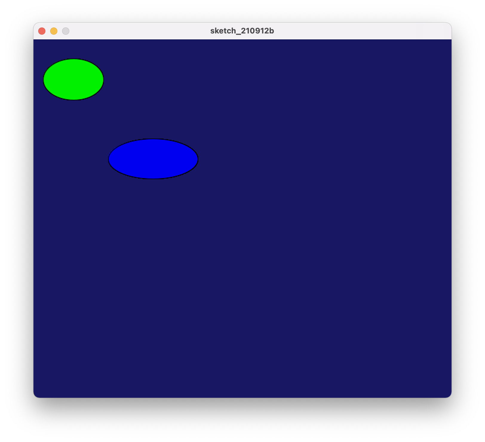
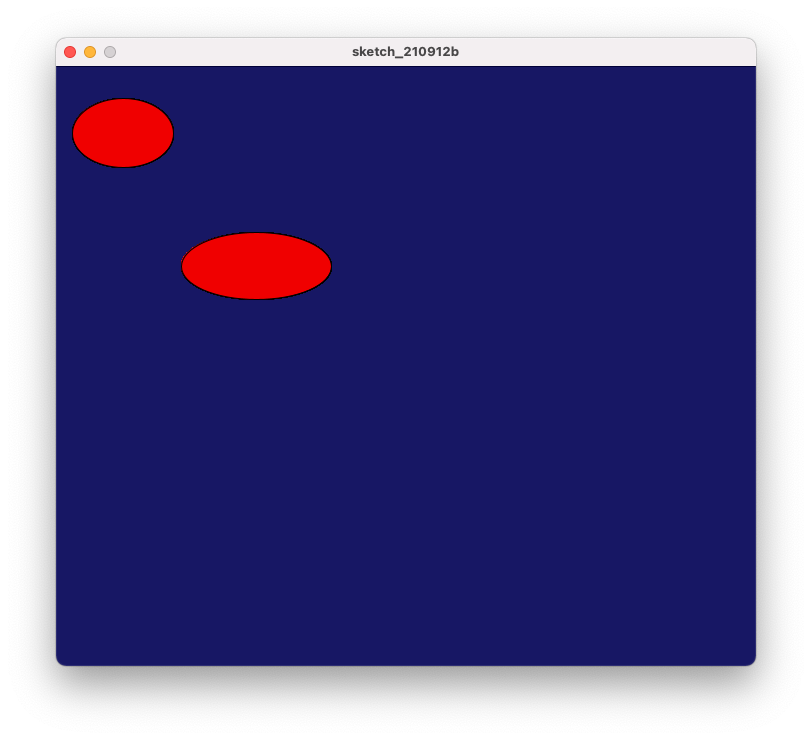
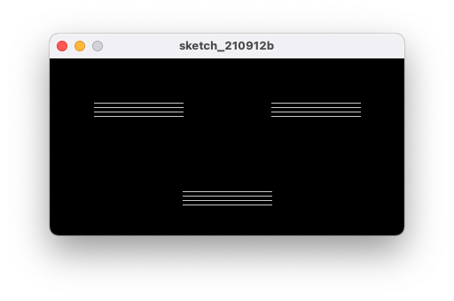
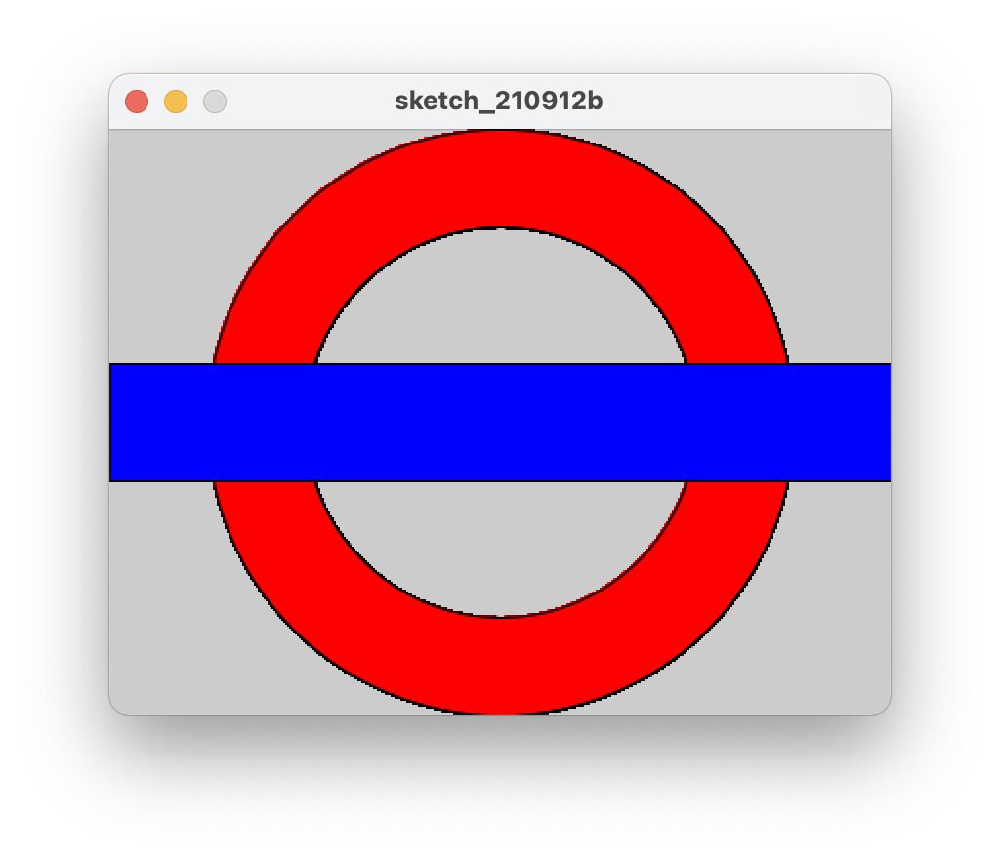

# FILL() function

The `FILL()` function sets the colour to fill shapes that are created after it.

## Part 1

In this example, `FILL()` is called before creating each ellipse, which sets the colour for each ellipse to be different.

```processing
void setup() {
    size(700, 600);
    background(23, 23, 100);
}

void draw() {
    fill(0, 240, 0);
    ellipse(67, 67, 101, 69);
    fill(0, 0, 240);
    ellipse(200, 200, 150, 67);
}
```



## Part 2

In this example, `FILL()` is called during `setup()`, which essentially does the same thing as the first example, as all following shapes are set to fill to the specified colour -- a shade of red.

```processing
void setup() {
    size(700, 600);
    background(23, 23, 100);
    fill(240, 0, 0);
}

void draw() {
    ellipse(67, 67, 101, 69);
    ellipse(200, 200, 150, 67);
}
```



# Task 1

```processing
/// sets up the environment.
void setup() {
    size(400, 200);
    background(0, 0, 0);
    stroke(200, 200, 200);
}

/// called every frame.
void draw() {
  drawLineGroup(50, 50);
  drawLineGroup(250, 50);
  drawLineGroup(150, 150);
}

/// draws 4 horizontal lines which are 100 pixels long, with a spacing of 5 pixels between each of the lines.
void drawLineGroup(float x, float y) {
  for (int i = 0; i < 4; i++) {
    int offset = 5 * i;
    drawStraightLine(x, y + offset);
  }
}

/// draws a horizontal line which is 100 pixels long.
void drawStraightLine(float x, float y) {
  line(x, y, x+100, y);
}
```



# Task 2

```processing
void setup() {
  size(400,  300);
}

void draw() {
  drawRing(50, 0, 200, 100);

  fill(0, 0, 255);
  rect(0, 120, 400, 60);
}

// Draws the red ring behind the blue bar.
void drawRing(float x, float y, int radius, int width) {
  int maxRadius = radius + width;
  float center = maxRadius / 2;

  // Creates an isolated graphic "context" to draw the circle within.
  // This allows us to manipulate the end product of this graphic.
  // Without affecting anything else on the main graphic displayed
  // on the window.
  PGraphics redCircle = createGraphics(maxRadius + 2, maxRadius + 2);
  redCircle.beginDraw();
  redCircle.fill(255, 0, 0);
  // Draw the red circle
  redCircle.ellipse(center, center, maxRadius, maxRadius);

  // This means that the alpha value of the filled shape will affect the
  // graphic.
  redCircle.blendMode(REPLACE);
  // Since the alpha value is 0, it means that anything below it will be
  // subtracted.
  redCircle.fill(255, 255, 255, 0);
  redCircle.ellipse(center, center, radius, radius);
  redCircle.endDraw();

  // Draw the graphic onto the main graphic shown on the window.
  image(redCircle, x, y);
}
```


